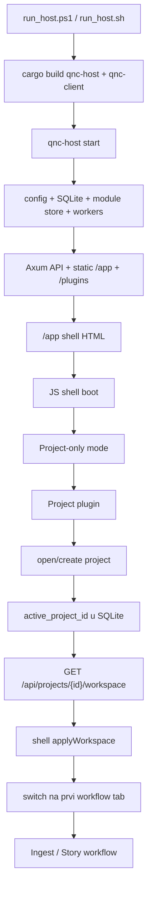
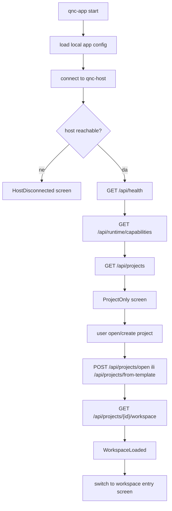

# QNC native Rust aplikacija — plan migracije programskog toka

Status: prijedlog plana, bez implementacijskog koda.

Legacy note: ovaj dokument je stariji migracijski plan i nije kanonska istina
za trenutno `qnc_v4` stanje. Kanonski runtime/player opis je u
`docs/qnc-playback-engine.md` i root `README.md`.

Original workspace at the time of writing: `C:\Users\miron\Projects\QNC`

**Usklađena verzija (playback ownership + client-server):**  
→ [qnc-native-migration-plan.md](qnc-native-migration-plan.md) — koristi taj doc kao kanonski redoslijed kad krene implementacija.

## Cilj

Napraviti jedan native Rust klijent `qnc-app` za Windows, Linux i macOS koji koristi postojeći `qnc-host` kao server/runtime.

Zahtjevi:

- bez JS-a, HTML-a, WebViewa i web komponenti u novom native UI-ju
- postojeći `qnc-host` ostaje Rust backend, API, SQLite, worker runtime i source of truth
- isti `qnc-app` binarni program radi lokalno, na LAN-u ili preko interneta
- medij se ne smije obavezno uploadati samo zato što se koristi native klijent
- UI i playback moraju biti projektirani za broadcast-grade rad: frame točnost, stabilan A/V sync, timecode, fps/drop-frame podrška i deterministički export plan

## Trenutni programski tok

Trenutni web shell radi ovako:



Ključna pravila koja treba zadržati:

1. Aplikacija se diže u Project-only modu.
2. Korisnik prvo otvara ili kreira projekt.
3. `qnc-host` zapisuje `active_project_id` u SQLite.
4. Klijent učitava workspace preko `/api/projects/{id}/workspace`.
5. Workspace određuje dostupne workflow ekrane.
6. Nakon otvaranja projekta prelazi se na prvi workflow ekran, najčešće Ingest.
7. Plugin/orchestrator state nije source of truth; baza i Rust API jesu.

## Ciljna arhitektura

```text
qnc_v4/
  qnc-host/          Rust API, SQLite, workers, ingest, proxy, waveform, story data
  qnc-app/           novi native Rust desktop klijent
    src/
      main.rs
      app_shell/
      api/
      project/
      ingest/
      story/
      media/
      playback/
      timeline/
      platform/
      ui/
  app/               legacy web UI, samo referenca tokom migracije
  plugins/           legacy JS orchestratori, samo referenca tokom migracije
```

`qnc-host` ostaje server. `qnc-app` postaje primarni klijent.

Ne migrirati HTML/JS komponente jednu po jednu. Migrirati ponašanje, podatkovni tok i korisnički workflow.

## Preporučeni native stack

Preporučeni smjer:

```text
winit          window + event loop
wgpu           GPU rendering
egui/egui-wgpu native UI overlay i alati
ffmpeg/libav   media probe, decode, frame extraction
cpal/rodio     audio output ako se ne koristi drugi audio pipeline
tokio          async runtime
reqwest        HTTP API client prema qnc-host
serde          API modeli
```

Razlog:

- broadcast UI treba kontrolu nad frame timingom, timelineom i playbackom
- timeline i video površine ne smiju ovisiti o browser render loopu
- `wgpu` daje multiplatform GPU sloj
- `egui` je dovoljno brz za native alate, inspektore, panele i prototip native workflowa

Alternativa je `Slint`, ali za video/timeline-heavy aplikaciju `winit + wgpu + egui` je sigurniji tehnički temelj.

## Novi programski tok u `qnc-app`

Native aplikacija treba imati eksplicitan state machine:

```rust
enum AppState {
    Booting,
    HostDisconnected,
    ProjectOnly(ProjectScreenState),
    WorkspaceLoaded(WorkspaceState),
}
```

Startni tok:



Native ekvivalenti trenutnog JS shella:

| Trenutni web mehanizam | Native Rust zamjena |
|---|---|
| `showProjectOnly()` | `AppState::ProjectOnly` |
| `project:opened` bus event | typed `AppEvent::ProjectOpened(ProjectId)` |
| `applyWorkspace()` | `WorkspaceState::apply(workspace)` |
| `switchTab(tab)` | `ScreenRouter::activate(screen_id)` |
| plugin manifest | Rust module registry |
| JS orchestrator | Rust screen/controller |
| component bus | typed Rust event bus |
| component HTML | native widgets/custom GPU drawing |

## Rust module registry

Umjesto plugin JSON + JS orchestratora:

```rust
trait QncModule {
    fn id(&self) -> &'static str;
    fn title(&self) -> &'static str;
    fn load(&mut self, ctx: &mut AppContext);
    fn update(&mut self, event: AppEvent, ctx: &mut AppContext);
    fn render(&mut self, ui: &mut Ui, ctx: &mut AppContext);
}
```

Početni moduli:

- `ProjectModule`
- `IngestModule`
- `StoryModule`
- `ExportModule` kasnije
- `SettingsModule` kasnije

Workspace iz hosta mapira se u native screenove:

```rust
enum QncScreen {
    Project,
    Ingest,
    Story,
    Export,
    Settings,
}
```

Ako host vrati workflow tab koji `qnc-app` ne podržava, aplikacija mora prikazati kontroliranu poruku, ne pasti.

## Faza 1 — API contract za native klijent

Prvo stabilizirati contract između `qnc-app` i `qnc-host`.

Minimalni endpointi:

```text
GET  /api/health
GET  /api/runtime/capabilities
GET  /api/projects
POST /api/projects/open
POST /api/projects/from-template
GET  /api/projects/{id}/workspace

GET  /api/ingest/state?project_id=...
POST /api/ingest/browse
POST /api/ingest/discover
POST /api/ingest/import

GET  /api/story/state?project_id=...
GET  /api/story/timeline-model?project_id=...
POST /api/story/playback/start
POST /api/story/playback/stop
POST /api/story/playback/seek

GET  /api/media/resolve
GET  /api/media/probe
GET  /api/media/frame
GET  /api/media/waveform
```

Dodati `runtime/capabilities` ako trenutni `/api/shell/runtime` nije dovoljno formalan.

Primjer capability odgovora:

```json
{
  "host_id": "qnc-local-01",
  "api_version": 1,
  "server_os": "windows",
  "features": {
    "project_templates": true,
    "ingest": true,
    "story": true,
    "proxy_generation": true,
    "native_file_dialogs": false
  },
  "media_access": {
    "server_local_paths": true,
    "shared_filesystem": true,
    "client_local_paths": true,
    "upload_required": false
  }
}
```

## Faza 2 — novi crate `qnc-app`

Dodati novi Rust crate:

```text
qnc-app/
  Cargo.toml
  src/
    main.rs
    app_shell/
    api/
    project/
    ingest/
    story/
    media/
    playback/
    timeline/
    platform/
    ui/
```

Root `Cargo.toml` treba uključiti `qnc-app` kao workspace member.

Prvi cilj nije puni UI. Prvi cilj je:

- otvoriti native window
- spojiti se na `qnc-host`
- prikazati host status
- prikazati Project-only ekran
- otvoriti postojeći projekt
- učitati workspace
- prebaciti se na prvi native workflow screen

## Faza 3 — native Project screen

Project screen je prvi stvarni ekran jer je gate za cijeli workflow.

Funkcije:

- lista projekata
- active project oznaka
- create from template
- open project
- host selector:
  - local
  - LAN URL
  - manual URL
- status konekcije
- poruke grešaka iz API-ja

Ne treba kopirati web layout 1:1. Treba kopirati tok i podatke.

`project` modul:

```text
qnc-app/src/project/
  mod.rs
  screen.rs
  state.rs
  api.rs
  templates.rs
```

Acceptance criteria:

- app se diže bez otvorenog projekta
- vidi popis projekata
- može otvoriti postojeći projekt
- nakon opena učita workspace
- ako nema hosta, prikazuje HostDisconnected stanje

## Faza 4 — native workflow shell

Nakon Project screena implementirati shell za workflow ekrane.

Funkcije:

- footer/sidebar sa screenovima iz workspacea
- aktivni project label
- server/host label
- workflow entry screen
- kontrolirani redirect na Project ako nema otvorenog projekta

Ovo zamjenjuje trenutni JS:

- `QNC.shell.showProjectOnly`
- `QNC.shell.applyWorkspace`
- `QNC.shell.workflowEntryTab`
- `QNC.switchTab`

Acceptance criteria:

- direktan pokušaj otvaranja Ingesta bez projekta nije moguć
- workspace određuje dostupne ekrane
- promjena projekta resetira screen state

## Faza 5 — native Ingest screen

Ingest je drugi prioritet jer potvrđuje realni rad s medijima.

Funkcije:

- native folder picker
- source folder prikaz
- media grid
- clip select/toggle
- discover
- import
- progress/status za background jobs
- thumbnail/duration/proxy status
- error panel

`ingest` modul:

```text
qnc-app/src/ingest/
  mod.rs
  screen.rs
  state.rs
  api.rs
  media_grid.rs
  jobs.rs
```

Acceptance criteria:

- app može odabrati folder
- host može napraviti discover
- grid prikazuje clipove i statuse
- import se pokreće i prati kroz API
- nakon importa može prijeći na Story ako workflow tako kaže

## Faza 6 — media access model

Ovo je kritična faza za lokalni/LAN/internet rad bez obaveznog uploada.

Uvesti formalni model:

```rust
enum MediaAccessMode {
    ServerLocalPath,
    SharedFilesystem,
    ClientLocalPath,
    UploadedAsset,
    ProxyOnly,
}
```

Problem koji mora biti riješen:

- lokalno: `qnc-app` i `qnc-host` vide isti disk
- LAN: client path i server path često nisu isti
- internet: server najčešće ne vidi client file
- shared storage: Windows/Linux/macOS pathovi se razlikuju

Uvesti path mapping:

```text
Windows client: Z:\Media\ProjectA
Linux host:     /mnt/media/ProjectA
macOS client:   /Volumes/Media/ProjectA
```

Potrebni koncepti:

- `media_source_id`
- original path na strani hosta
- original path na strani clienta
- fingerprint filea
- size + modified time + optional hash
- path mapping profile
- media availability status

Acceptance criteria:

- app jasno zna vidi li original client, host ili oba
- playback ne pretpostavlja da server path vrijedi na clientu
- upload nije obavezan za lokalni/shared filesystem mode
- internet mode eksplicitno traži upload, proxy ili remote accessible storage ako original nije dostupan

## Faza 7 — native playback engine

Playback ne smije biti dodatak na kraju. Za broadcast-grade alat treba ga dizajnirati kao centralni subsystem.

Funkcije:

- frame-accurate seek
- source playback
- story preview playback
- A/V sync
- keyboard stepping
- in/out loop
- proxy/original switch
- deterministic timebase

`playback` modul:

```text
qnc-app/src/playback/
  mod.rs
  clock.rs
  decoder.rs
  audio.rs
  video.rs
  sync.rs
  session.rs
```

Model:

```rust
struct PlaybackSession {
    project_id: ProjectId,
    source: PlaybackSource,
    timebase: Timebase,
    playhead: FrameNumber,
    state: PlaybackState,
}
```

Za source playback native app treba preferirati client-local original ako je dostupan. Ako nije, fallback može biti proxy/frame API iz hosta.

Obavezna pravila za Story/source playback:

- postoje dvije vrste virtualnih kadrova: source virtual shot (`import_root`, cijeli source clip, Story All tab) i virtual shot (`virtual`, dio source virtual shot-a, Story Virtual tab)
- Story Segment tab koristi virtual segment (`story_parts.part_id`), koji može referencirati `virtual_shot_id` ili vlastiti `clip_id + in_frame/out_frame` source range
- primarni playback input je `virtual_shot_id`; host iz SQLite resolvea `clip_id`, source frame IN/OUT i source FPS
- za Segment-tab playback primarni input je `part_id`; host iz SQLite resolvea `clip_id`, source frame IN/OUT i source FPS
- `clip_id + in/out` smije ostati samo fallback za privremeni source preview prije nego postoji durable shot ili segment identitet
- source FPS dolazi iz probea source datoteke (`ingest_assets.fps` / virtual-shot source metadata), nikad iz project timeline FPS-a
- project/export FPS je samo export postavka; Story/Segment runtime, marker/slot math i playback koriste source FPS iz probe/DB
- news export smije biti p50 ili i50; `fps=25 + upper_first + i50` je 50-field delivery. PAL single-rate progressive export nije valjan project/export profil.
- trenutni `ffmpeg rawvideo + rodio` path je privremeni preview; broadcast motor mora imati jedan master clock, frame queue, audio device latency compensation i drop/repeat politiku

## Faza 8 — native Story screen

Story portati tek nakon Project + Ingest + media access modela.

Funkcije:

- story state load
- part list
- marker editor
- cover frame
- source viewer
- preview viewer
- timeline
- playback controls
- commit/export controls
- keyboard shortcuts

`story` modul:

```text
qnc-app/src/story/
  mod.rs
  screen.rs
  state.rs
  api.rs
  parts.rs
  markers.rs
  covers.rs
  timeline_controller.rs
```

Timeline:

- ne implementirati kao običnu listu widgeta
- koristiti custom drawing preko `wgpu`/`egui` paint API-ja
- timebase mora biti frame-based, ne float-second based

Acceptance criteria:

- story state se učitava iz hosta
- promjena projekta resetira story state
- timeline prikazuje frame-točne segmente
- marker/cover promjene idu kroz Rust API
- playback i UI koriste isti timebase

## Faza 9 — broadcast standard kriteriji

Minimalni kriteriji:

### Video

- frame-accurate seek
- timecode `HH:MM:SS:FF`
- podrška za:
  - 23.976
  - 24
  - 25
  - 29.97 drop-frame
  - 30
  - 50
  - 59.94 drop-frame
  - 60
- deterministic in/out
- proxy/original parity check
- source duration iz probea, ne iz UI pretpostavki

### Audio

- stabilan A/V sync
- waveform cache
- LUFS analiza kao zasebni job
- peak/true-peak metadata
- jasna razlika između preview mixa i export mixa

### Metadata

- file fingerprint
- codec/container metadata
- fps/timebase
- color space
- transfer function
- color range
- audio sample rate/channel layout

### Export

- render plan mora biti serializiran i reproducibilan
- export ne smije ovisiti o UI-only stateu
- svaki error mora sadržati:
  - project id
  - source clip id
  - timestamp/frame
  - operaciju koja je pala

## Faza 10 — packaging i runtime modovi

Svaki OS builda vlastiti binary.

```text
Windows:
  qnc-host.exe
  qnc-app.exe

Linux:
  qnc-host
  qnc-app

macOS:
  qnc-host
  qnc-app.app
```

Runtime modovi:

### Local

- `qnc-app` pokreće ili pronalazi lokalni `qnc-host`
- oba procesa vide isti lokalni filesystem
- native dialogs rade u appu

### LAN

- `qnc-app` se spaja na `http://host-ip:8001`
- media access mora biti `SharedFilesystem`, `ServerLocalPath`, `ClientLocalPath` ili `ProxyOnly`
- path mapping je obavezan ako client i host koriste različite pathove

### Internet

- HTTPS endpoint
- auth obavezan
- media access ne smije biti implicitni local path
- dozvoljeni modovi:
  - uploaded asset
  - remote shared storage
  - proxy-only
  - client-local playback uz host metadata, ako je file verificiran fingerprintom

## Faza 11 — migracijski redoslijed

Ne gasiti web UI prije nego native pokrije osnovni tok.

Redoslijed:

1. Dodati `qnc-app` crate.
2. Dodati native app config.
3. Implementirati host connect + health.
4. Uvesti formalni runtime capabilities endpoint.
5. Implementirati Project-only native shell.
6. Implementirati Project screen.
7. Implementirati open/create project tok.
8. Implementirati workspace load.
9. Implementirati native workflow screen router.
10. Implementirati Ingest read-only state.
11. Implementirati native folder picker.
12. Implementirati discover/import.
13. Uvesti `MediaAccessMode`.
14. Uvesti path mapping.
15. Implementirati source media resolve za native app.
16. Implementirati osnovni playback engine.
17. Implementirati Story read-only screen.
18. Implementirati Story timeline i marker edit.
19. Implementirati story preview playback.
20. Implementirati broadcast validation.
21. Implementirati packaging za Windows.
22. Tek zatim Linux/macOS build provjere.
23. Nakon parity checka web UI označiti kao legacy.

## Ne raditi u prvom koraku

- ne prepisivati cijeli Story odjednom
- ne dirati staru verziju projekta
- ne uvoditi Python
- ne uvoditi Tauri/WebView
- ne kopirati web komponente u Rust kao 1:1 layout
- ne hardcodirati Windows pathove u shared kod
- ne pretpostaviti da LAN client i host vide iste medijske putanje
- ne tretirati `/api/story/native/launch` kao finalni LAN/internet model

## Prvi konkretni milestone

Milestone 1: native Project-first shell.

Output:

```text
qnc-app.exe
  - otvara native window
  - spaja se na qnc-host
  - prikazuje Project-only screen
  - lista postojeće projekte
  - može otvoriti projekt
  - učitava workspace
  - prebacuje se na Ingest placeholder screen
```

Ovaj milestone dokazuje da je osnovni programski tok uspješno prenesen iz web shella u native Rust aplikaciju.

## Definicija uspjeha

Native migracija je uspješna tek kad vrijedi:

- `qnc-app` može raditi bez JS/HTML/WebView sloja
- `qnc-host` ostaje jedini backend/runtime
- Project-first workflow je isti kao sada
- Ingest i Story koriste iste API/DB izvore istine
- mediji ne moraju biti uploadani u lokalnom/shared filesystem modu
- LAN/internet ponašanje je eksplicitno definirano capabilities + media access modelom
- playback i timeline koriste frame-based timebase
- export plan ne ovisi o UI stateu
